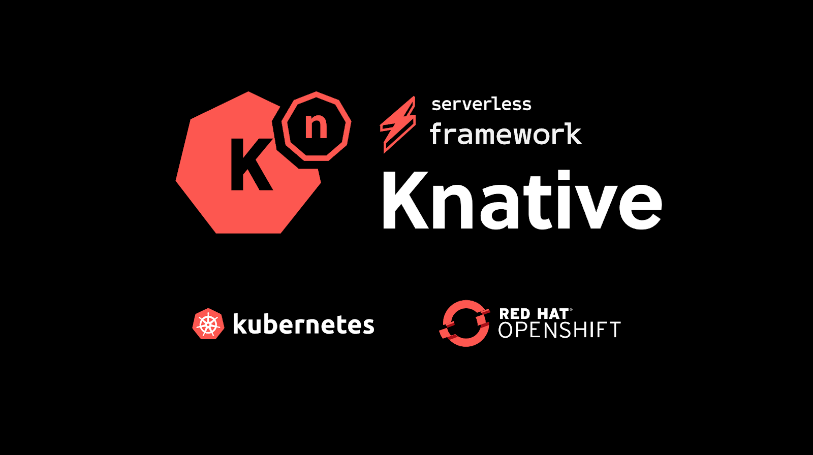

# **Iniciación a OpenShift Serverless y Knative Serving**

## **Índice**
  - [**1. Introducción**](introduccion.md/#1-introducción)
    - [**1.1. Introducción a Serverless**](introduccion.md/#11-introducción-a-serverless)
    - [**1.2. Objetivos**](introduccion.md/#12-objetivos)
    - [**1.3. Público Objetivo**](introduccion.md/#13-público-objetivo)
    - [**1.4. Requisitos previos**](introduccion.md/#14-requisitos-previos)
  - [**2. Red Hat OpenShift Serverless**](serverless.md/#2-red-hat-openshift-serverless)
    - [**2.1. Ventajas de Serverless**](serverless.md/#21-ventajas-de-serverless)
    - [**2.2. Cuándo utilizar Serverless**](serverless.md/#22-cuándo-utilizar-serverless)
    - [**2.3. Cuándo NO utilizar Serverless**](serverless.md/#23-cuándo-no-utilizar-serverless)
    - [**2.4. Instalación del Operador OpenShift Serverless**](serverless.md/#24-instalación-del-operador-openshift-serverless)
  - [**3. Knative Serving**](serving.md/#3-knative-serving)
    - [**3.1. Instalación de Knative Serving**](serving.md/#31-instalación-de-knative-serving)
    - [**3.2. Instalación de Knative CLI**](serving.md/#32-instalación-de-knative-cli)
    - [**3.3. Desplegando aplicaciones Serverless**](serving.md/#33-desplegando-aplicaciones-serverless)
    - [**3.4. Inspeccionando una aplicación Serverless**](serving.md/#34-inspeccionando-una-aplicación-serverless)
    - [**3.5. Actualizando una aplicación Serverless**](serving.md/#35-actualizando-una-aplicación-serverless)
  - [**4. Gestionar Revisiones de Servicios y Control de Tráfico**](revision.md/#4-gestionar-revisiones-de-servicios-y-control-de-tráfico)
    - [**4.1 Implementación Blue/Green**](revision.md/#41-implementación-bluegreen)
    - [**4.2. Implementación Canary**](revision.md/#42-implementación-canary)
    - [**4.3. Enrutamiento de tráfico**](revision.md/#43-enrutamiento-de-tráfico)
  - [**5. Aplicaciones Serverless Autoscale**](autoescale.md/#5-aplicaciones-serverless-autoscale)
    - [**5.1. Definición de Escalado Automático**](autoescale.md/#51-definición-de-escalado-automático)
    - [**5.2. Configuración de Autoscaling**](autoescale.md/#52-configuración-de-autoscaling)
      - [**5.2.1. Escalado a Cero**](autoescale.md/#521-escalado-a-cero)
      - [**5.2.2. Configuración de límites**](autoescale.md/#522-configuración-de-límites)
      - [**5.2.3. Configuración de concurrencia**](autoescale.md/#523-configuración-de-concurrencia)
      - [**5.2.4. Arranques en frío**](autoescale.md/#524-arranques-en-frío)
      - [**5.2.5. Configuración de Autoscaling mediante la Consola Web**](autoescale.md/#525-configuración-de-autoscaling-mediante-la-consola-web)
  - [**6. Casos Prácticos**](demo.md/#6-casos-prácticos)
    - [**6.1. Despliegue de una aplicación Serverless con Knative Serving**](demo.md/#61-despliegue-de-una-aplicación-serverless-con-knative-serving)
    - [**6.2. Gestionar Revisiones de Servicios, Controlar el Tráfico, Etiquetas y Autoscaling**](demo.md/#62-gestionar-revisiones-de-servicios-controlar-el-tráfico-etiquetas-y-autoscaling)
  - [**7. Conclusiones**](conclusion.md/#7-conclusiones)
  - [**8. Bibliografía**](bibliografia.md/#8-bibliografía)
