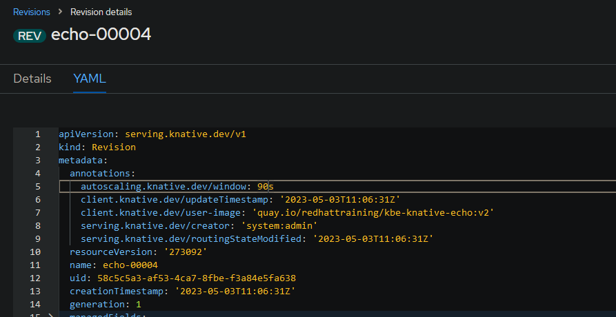
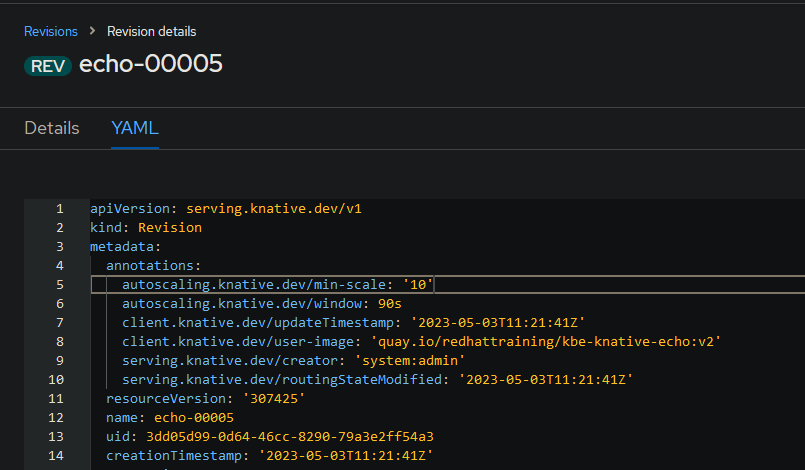
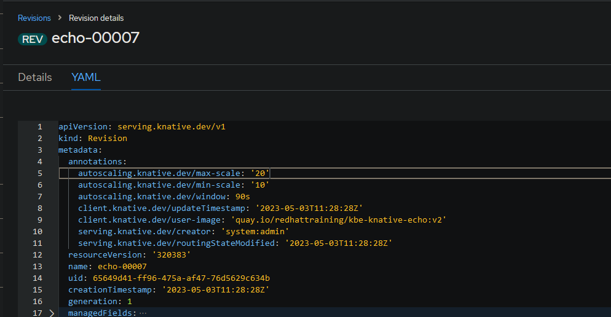
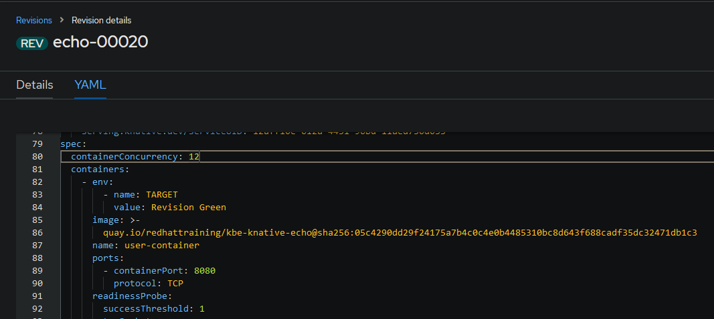
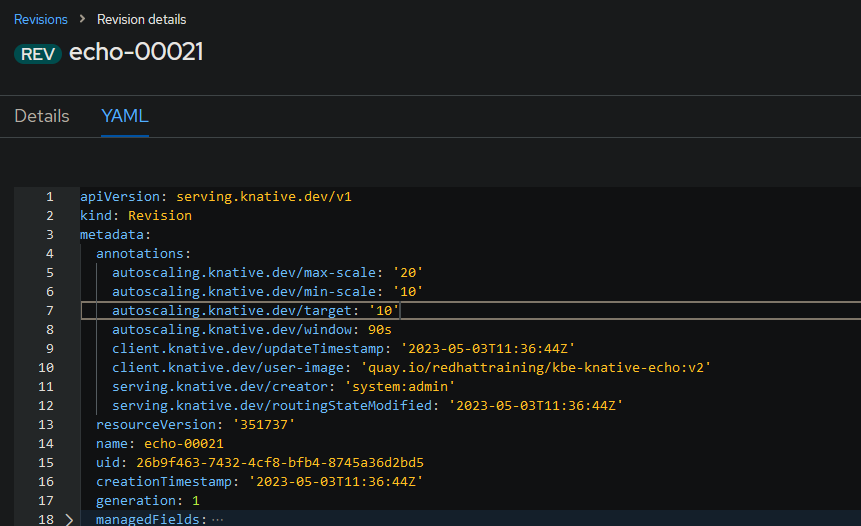

## **5. Aplicaciones Serverless Autoscale**

**Definición de Escalado**

El escalado es el proceso de ajustar los recursos del sistema disponibles para nuestra aplicación en respuesta a los cambios en la demanda de procesamiento.

Existen dos tipos de escalado:

**Escalado vertical**

En este tipo de escalado, aumentaremos o reduciremos los recursos de hardware asignados a nuestra aplicación o sistema. Por ejemplo, podemos aumentar la CPU y la RAM de nuestra instancia de aplicación para responder a un aumento en los visitantes de nuestro comercio electrónico durante la temporada de ventas.

**Escalado horizontal**

En este tipo de escalado, aumentaremos o reduciremos el número de unidades de procesamiento de nuestro aplicación o sistema. Por ejemplo, podremos aumentar el número de instancias de aplicación para responder a un aumento en los visitantes de nuestro comercio electrónico durante la temporada de ventas.

### **5.1. Definición de Escalado Automático**

El escalado automático o autoscaling es una técnica para ajustar dinámicamente los recursos asignados a nuestra aplicación en respuesta a una fluctuación en la cantidad de trabajo a procesar.

En Knative, el componente autoscaler es responsable de escalar automáticamente nuestras aplicaciones y solo admite el escalado horizontal. El autoscaler supervisa el número de solicitudes enviadas a un servicio durante un período de tiempo, calcula el número de instancias necesarias en función del tráfico entrante y actualiza el servicio de Knative para reflejar el cálculo.

Por ejemplo, si nuestra aplicación recibe de repente un alto volumen de tráfico, entonces el autoscaler aumenta el número de instancias de nuestra aplicación para satisfacer las demandas. Cuando el pico de tráfico termina, el autoscaler reduce el número de instancias de nuestra aplicación para evitar el desperdicio de recursos.

### **5.2. Configuración de Autoscaling**

Podemos configurar el autoscaling utilizando ajustes globales o ajustes por revisión. Cuando utilizamos ambos, los ajustes por revisión tienen prioridad sobre los ajustes globales.

El Operador Serverless de OpenShift gestiona la configuración global de una instalación de Knative.
El operador propaga los valores de configuración almacenados en el Recurso Personalizado KnativeServing (CR) al ConfigMap llamado config-autoscaler. Los administradores del clúster pueden configurar los ajustes globales actualizando el CR de KnativeServing.

Como desarrollador, podemos usar el siguiente comando para inspeccionar las configuraciones globales de escalado automático:
```bash
oc get configmap config-autoscaler \
-n knative-serving \                # Espacio de nombres donde se ejecuta el componente de servicio.
-o=yaml                             # Formato de salida.
```         

#### **5.2.1. Escalado a Cero**

Una de las principales ventajas de los sistemas Serverless es la capacidad de escalar a cero cuando nuestra aplicación está esperando trabajo para procesar. Después de un tiempo de inactividad en nuestra aplicación, Knative marca la revisión del servicio como inactiva.

Luego, termina todos los pods que corresponden a la revisión inactiva y redirige las rutas al servicio activador. A partir de ese momento, el activador es el punto final para el tráfico de la aplicación. 

Tan pronto como el activador recibe nuevas solicitudes, las almacena en búfer hasta que el escalador automático tenga un pod listo para procesar las solicitudes.

Para controlar cómo se escala nuestra aplicación a cero, podemos usar las siguientes configuraciones de escalado automático:

**enable-scale-to-zero**

Esta configuración global controla si las réplicas se reducen a cero o se detienen en una réplica. Podemos usar la clave enable-scale-to-zero para controlar esta configuración. El valor predeterminado para la configuración enable-scale-to-zero es verdadero, lo que significa que las réplicas se reducen a cero. Cuando el valor de la configuración es falso, entonces las réplicas se reducen a una.

**stable-window**
    
Define el período de tiempo en el que el escalador automático supervisa las revisiones para marcarlas como inactivas. Si no hay solicitudes durante el período definido, entonces el escalador automático establece la revisión como inactiva. El valor predeterminado de la ventana estable es de 60 segundos. 

Podemos definir el período de tiempo globalmente con la clave stable-window o por revisión con la clave de anotación autoscaling.knative.dev/window.



Alternativamente, podemos usar la opción "--scale-window" disponible en el comando kn service para agregar o actualizar la ventana estable de un servicio Knative. 
El siguiente ejemplo actualiza el servicio Knative echo para tener una ventana estable de 90 segundos:
```bash
kn service update echo --scale-window 90s
```

**scale-to-zero-grace-period**
    
Esta configuración global define el período de tiempo en el que el escalador automático supervisa las pods inactivas y termina esas pods. El valor predeterminado es de 30 segundos, y podemos definir un período de tiempo diferente con la clave scale-to-zero-grace-period.

El período de terminación es el tiempo que el autoscaler tarda en terminar los pods inactivos. Puede calcularse sumando la ventana estable más el período de gracia para escalar a cero.

#### **5.2.2. Configuración de límites**

Los límites de escalado controlan el número de instancias creadas para una revisión. Podemos definir dos límites de escalado en nuestras aplicaciones Serverless:

**Escala mínima**

Este valor define el número mínimo de réplicas que necesita cada revisión. Podemos definir el límite globalmente con la clave min-scale, o por revisión con la clave de anotación autoscaling.knative.dev/min-scale.



Alternativamente, podríamos utilizar la opción "--scale-min" disponible en el comando kn service para definir el límite. 
El siguiente ejemplo actualiza el servicio Knative echo para tener un mínimo de 10 réplicas para cada revisión:
```bash
kn service update echo --scale-min 10
```

**Escala máxima**

Esta configuración define el número máximo de réplicas que cada revisión puede tener. Knative por defecto no establece un límite superior al número de pods que podemos utilizar, lo que podría dar lugar a que una aplicación consuma un número excesivo de recursos. 

Al establecer un límite máximo de escala, protegemos el sistema de la creación de demasiadas instancias de un servicio. Podemos definir el límite globalmente con la clave max-scale, o por revisión con la clave de anotación autoscaling.knative.dev/max-scale.



Alternativamente, podríamos utilizar la opción "--scale-max" disponible en el comando kn service para definir el límite. 
El siguiente ejemplo actualiza el servicio Knative echo para tener un máximo de 20 réplicas para cada revisión:
```bash
kn service update echo --scale-max 20
```

#### **5.2.3. Configuración de concurrencia**

La concurrencia determina el número de solicitudes simultáneas que una réplica puede procesar en un momento dado. Podemos configurar dos límites para la concurrencia de nuestras aplicaciones:

**Límite duro**

Este límite se aplica estrictamente. Es decir, si el número de solicitudes concurrentes alcanza el límite duro, entonces Knative almacena en búfer las solicitudes excedentes hasta que haya suficiente capacidad para procesarlas.

Podremos especificar un límite duro por revisión modificando la especificación containerConcurrency del servicio Knative, o utilizando la opción "--concurrency-limit" del comando kn service.



El siguiente ejemplo configura un límite duro de 12 solicitudes concurrentes en el servicio Knative llamado echo:
```bash
kn service update echo --concurrency-limit 12
```

**Límite suave**

Un límite suave es un límite de solicitudes objetivo. Por ejemplo, si hay una ráfaga repentina de tráfico, el objetivo de límite suave puede ser superado. Podemos definir el límite suave global con la clave container-concurrency-target-default, o por revisión con la clave de anotación autoscaling.knative.dev/target. El valor predeterminado es 100.



Alternativamente, podríamos utilizar la opción "--scale-target" disponible en el comando kn service para definir cuándo escalar en función del número concurrente de solicitudes entrantes.

El siguiente ejemplo actualiza el servicio Knative echo para tener un límite suave de 10 solicitudes concurrentes:
```bash
kn service update echo --scale-target 10
```

#### **5.2.4. Arranques en frío**

Un arranque en frío ocurre cuando nuestra aplicación no tiene pods listos y llega una solicitud. Debido a que no hay pods disponibles, la solicitud debe esperar a que Kubernetes cree un pod, y este proceso agrega latencia al procesamiento de la solicitud.

Podemos reducir este problema estableciendo un límite inferior de escala más bajo. Por ejemplo, si establecemos el número 1 como límite inferior de escala para nuestras revisiones, entonces garantizamos que tenemos un pod en ejecución y esperando para procesar solicitudes.

#### **5.2.5. Configuración de Autoscaling mediante la Consola Web**

Al utilizar la consola web de Red Hat OpenShift Container Platform (RHOCP), podremos definir o actualizar la configuración de autoscaling de los servicios de Knative desplegados. Antes vimos ejemplos de ficheros YAML, pero no se explicó como llegar a ellos.

**Configuración de Autoscaling mediante la Consola Web**

1. Iniciamos sesión en nuestra consola web de RHOCP y cambiamos a la perspectiva de administrador.
2. Hacemos clic en Serverless > Serving.
3. En la parte superior izquierda de la página de Serving, hacemos clic en el selector de proyecto y seleccionamos nuestro proyecto.
4. En la lista de servicios de Knative, hacemos clic en el nombre del servicio de Knative que deseamos actualizar.
5. En la parte superior de la página de detalles del servicio, hacemos clic en YAML.
6. Actualizamos la definición YAML para agregar o actualizar las anotaciones de autoscaling y hacemos clic en Guardar para persistir los cambios.
