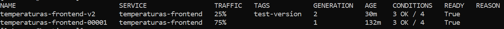

## **6. Casos Prácticos**

Para la realización de estos dos casos prácticos, utilizaré una aplicación que posee back-end. La aplicación se llama **"temperaturas"**, es de José Domingo Muñoz Rodríguez y se encuentra en el siguiente repositorio de [GitHub](capturas/https://github.com/iesgn/curso_kubernetes_cep/tree/main/build/temperaturas). 

Partiremos con el código fuente de la aplicación y la desplegaremos en un cluster de OpenShift Container Platform (OCP) con Serverless, Knative Serving y Knative CLI ya instalados.

### **6.1. Despliegue de una aplicación Serverless con Knative Serving**

**Enunciado**

Vamos a desplegar una aplicación Serverless con Knative Serving usando la consola web de Red Hat OpenShift Container Platform (RHOCP) y la CLI kn.

**Resultados esperados de este caso práctico**

Deberíamos ser capaces de realizar muchos escenarios de implementación de una aplicación Serverless con Knative Serving.

**Pasos a seguir usando la CLI kn**

Crearemos un nuevo proyecto llamado **"temperaturas-1"**.
```bash
oc new-project temperaturas-1
```

Ahora vamos a desplegar la aplicación usando la CLI kn, para ello vamos a crear un archivo YAML con la configuración de la aplicación front-end y back-end.
```bash
mkdir temperaturas && cd temperaturas && touch temperaturas-frontend-service.yaml temperaturas-backend-deploymentconfig.yaml temperaturas-backend-service.yaml
```

Contenido del archivo YAML front-end que define el servicio que proporciona nuestra aplicación, aquí es donde implementaremos la aplicación Serverless con Knative Serving:
```yaml
apiVersion: serving.knative.dev/v1
kind: Service
metadata:
  name: temperaturas-frontend
  labels:
    app: temperaturas
    tier: frontend
spec:
  template:
    spec:
      containers:
        - name: contenedor-temperaturas
          image: iesgn/temperaturas_frontend
          ports:
            - containerPort: 3000
      replicas: 3
```

Contenido del archivo YAML back-end que en este caso es un DeploymentConfig:
```yaml
apiVersion: apps.openshift.io/v1
kind: DeploymentConfig
metadata:
  name: temperaturas-backend
  labels:
    app: temperaturas
    tier: backend
spec:
  replicas: 1
  selector:
    app: temperaturas
    tier: backend
  template:
    metadata:
      labels:
        app: temperaturas
        tier: backend
    spec:
      containers:
        - name: contendor-servidor-temperaturas
          image: iesgn/temperaturas_backend
          ports:
            - name: api-server
              containerPort: 5000
```

Necesitará un servicio para exponer el puerto 5000 del contenedor:
```yaml
apiVersion: v1
kind: Service
metadata:
  name: temperaturas-backend
  labels:
    app: temperaturas
    tier: backend
spec:
  type: ClusterIP
  ports:
  - name: api-server
    port: 5000
    targetPort: api-server
  selector:
    app: temperaturas
    tier: backend
```

El motivo de que el back-end sea un DeploymentConfig y el front-end use Knative Serving es porque no estamos usando Knative Eventing.
Nuestro back-end siempre estaría consumiendo recursos, en cambio, el front-end solo consumiría recursos cuando haya peticiones de los usuarios. Si el back-end fuera serverless y solo estuvieramos usando Knative Serving jamás se ejecutaría, ya que no hay eventos que lo desencadenen cuando haya peteciiones de los usuarios al front-end.

Aplicamos los archivos YAML.
```bash
oc apply -f temperaturas-backend-deploymentconfig.yaml
oc apply -f temperaturas-backend-service.yaml
kn service apply -f temperaturas-frontend-service.yaml
```

Comprobamos que se ha creado el servicio serverless para el front-end con el comando:
```bash
kn service list
```

Comprobamos que se han creado los pods, las rutas, los deployments y los servicios con el comando:
```bash
oc get pods,route,deployment,service
```

Vamos a probar la aplicación.


Como vemos el front-end está funcionando correctamente, y conecta con el back-end. Al acceder a la web por primera vez, el front-end tarda unos segundos en cargar, esto es porque se han escalado a cero pods por inactividad, y al volver a recibir una petición se ha escalado a 3 pods (número de pods que hemos definido por defecto en el YAML).

**Pasos a seguir usando la consola web de RHOCP**

Crearemos un nuevo proyecto llamado **"temperaturas-2"**.

Reutilizaremos las imágenes de los contenedores que hemos creado en el apartado anterior.

Ahora vamos a desplegar la aplicación usando la consola web de RHOCP, para ello vamos a reutilizar los archivos YAML que hemos creado en el apartado anterior.

En mi caso para importar los archivos YAML he usado la opción de **"Import YAML"**.


Comprobamos que al dirigirnos a Topology, se han creado los objetos que hemos definido en los archivos YAML.


Podemos apreciar que los pods del back-end están autoescalados a 1 y los del front-end a 0 debido a que aún no hemos accedido a la web.	

Accederemos a la ruta del front-end y comprobaremos que la aplicación funciona correctamente.


Si volvemos a la consola web de RHOCP y nos dirigimos a Topology, podremos apreciar que los pods del front-end se han autoescalado.


**Conclusión**

Como conlusión del primer caso práctico, creo que trabajar con la interfaz web en este caso ha sido mucho más rápido y sencillo que trabajar con la CLI. Además, la interfaz web es muy intuitiva y visual, por lo que es bastante fácil de entender y de aprender a usar.

Como punto a favor de ambas formas de trabajar, la instalación del operador Serverless y Knative Serving ha sido muy sencilla en ambos casos. Lo único es que no debemos olvidar de instalar en la terminal el CLI kn, ya que si no no podremos trabajar con Knative Serving.

### **6.2. Gestionar Revisiones de Servicios, Controlar el Tráfico, Etiquetas y Autoscaling**

**Enunciado**

Vamos a crear múltiples revisiones de la aplicación anterior y dividiremos el tráfico entre ellas usando la consola web de Red Hat OpenShift Container Platform (RHOCP) y la CLI kn. Además añadiremos etiquetas a las revisiones, cambiaremos el tiempo de vida de los pods, su escala máxima, su escala mínima y su concurrencia.

**Resultados esperados de este caso práctico**

Deberíamos ser capaces de realizar muchos escenarios de implementación dirigiendo el tráfico a las revisiones de la aplicación y manejando las etiquetas, el tiempo de vida de los pods, su escala máxima, su escala mínima y su concurrencia.

**Pasos a seguir usando la CLI kn**

Vamos a crear una nueva revisión de la aplicación, para ello cambiaremos el nombre de la aplicación con el siguiente comando:
```bash
kn service update temperaturas-frontend --revision-name temperaturas-frontend-v2
```

Si ejecutamos el comando:
```bash
kn revision list
```

Podremos ver que se ha creado una nueva revisión de la aplicación.


Y si ejecutamos el comando:
```bash
kn route describe temperaturas-frontend
```

Podremos ver que los detalles de la ruta de la nueva revisión.


No vamos a querer que el 100% del tráfico vaya a la nueva revisión (queremos una implementación Canary no Blue/Green), así que para ello usaremos el siguiente comando:
```bash
 kn service update temperaturas-frontend \
--traffic temperaturas-frontend-00001=75 \
--traffic temperaturas-frontend-v2=25
```

Ahora, el tráfico se dividirá entre la revisión original y la nueva revisión.

Si volvemos a ejecutar el comando:
```bash
kn route describe temperaturas-frontend
```

Podremos ver que el tráfico se ha dividido entre las dos revisiones.


Vamos a añadirle una etiqueta (TEST-VERSION) a la nueva revisión, para ello usaremos el siguiente comando:
```bash
kn service update temperaturas-frontend \
--tag temperaturas-frontend-v2='test-version'
```

Si ejecutamos el comando:
```bash
kn revision list
```

Podremos ver que la nueva revisión tiene una etiqueta.



Si accedemos a la aplicación web, podremos ver que el hostname cambia, esto es debido a la división del tráfico entre las dos revisiones.

Revisión 1:


Revisión 2:


Ya solo nos queda cambiar el tiempo de vida de los pods, su escala máxima, su escala mínima y su concurrencia, para ello usaremos el siguiente comando (he creado una nueva revisión de la aplicación también):
```bash
kn service update temperaturas-frontend \
--scale-window 10s \
--scale-min 1 \
--scale-max 5 \
--concurrency-limit 2 \
--scale-target 10 \
--revision-name temperaturas-frontend-v3 \
--traffic @latest=100 \
--tag temperaturas-frontend-v3='final-version'
```

Con esta configuración, los pods se escalarán entre 1 y 5, el tiempo de vida de los pods será de 10 segundos, la concurrencia máxima será de 2 y el número de pods objetivo será de 10. También hemos cambiado el tráfico para que vaya todo a la nueva revisión y le hemos añadido una etiqueta.

Si ejecutamos el comando:
```bash
kn service describe temperaturas-frontend
```

Podremos ver que se han cambiado los parámetros de la aplicación.


Y si accedemos a la aplicación web, podremos ver que el hostname ha cambiado:


**Pasos a seguir usando la consola web de RHOCP**

Vamos a seguir trabajando con el mismo proyecto, temperaturas-1.

En este caso vamos a realizar algo parecido a lo que hemos hecho con la CLI kn, pero esta vez usando la consola web de RHOCP que es mucho más visual pero algo más limitada a mi parecer.

Nos dirigiremos a Topology y haremos click en el servicio temperaturas-frontend. Una vez dentro, haremos click en el botón Set Traffic.

Como ya hemos visto anteriormente, podemos modificar la división del tráfico entre las revisiones de la aplicación. En mi caso he cambiado las etiquetas de las revisiones para que sea más fácil identificarlas y también el tráfico que va a cada revisión.

<div align="center">

</div>

Veremos que nuestra topología cambiará, ya que ahora el tráfico se dividirá entre las tres revisiones y además podemos ver que la revisión 3 tiene un pod siempre escalado como configuramos anteriormente, mientras que las revisiones 1 y 2 no tienen ningún pod escalado.

<div align="center">

</div>

Podremos modifcar la configuración YAML de la cualquier revisión desde la interfaz web. Para ello nos dirigimos a la revisión que queramos en mi caso será la última. No dirigimos al apartado Configurations - YAML. En mi caso voy a modificar la escala mínima de 1 a 0. Una vez hecho esto, deberemos cambiar el nombre de la revisión, ya que no podemos modificar una revisión que ya existe. En mi caso la he llamado temperaturas-frontend-v4.

<div align="center">

</div>

Luego nos dirigiremos de nuevo a Set Traffic y desde ahí modificaremos el tráfico para que se divida entra la nueva revisión y la última revisión.

<div align="center">

</div>

Ahora tendremos una revisión con un pod escalado (aunque no reciba tráfico) y otra sin ningún pod escalado (al menos hasta que se reciba tráfico).

<div align="center">

</div>

**Conclusión**

Como conclusión final de este caso práctico, he de decir que la CLI kn me ha parecido mucho más potente que la interfaz web de RHOCP, aunque la interfaz web es muy visual y fácil de usar. Al ya estar trabajando con muchas más opciones y parámetros, la CLI kn es mucho más cómoda y rápida de usar. 

Un claro ejemplo es que con un simple comando en la CLI kn he creado una revisión nueva, le he cambiado el tráfico y le he añadido una etiqueta, además de muchas otras cosas. Sin embargo, para hacer lo mismo en la interfaz web he tenido que hacer varios pasos y he tenido que ir a varias secciones diferentes.

Lo único que rescataría de la interfaz web es la sección de Topology y Set Traffic, que son muy intuitivas y fáciles de usar.
