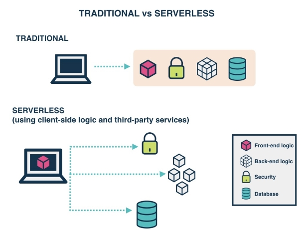

## **1. Introducción**

### **1.1. Introducción a Serverless**

Serverless es un modelo de desarrollo para aplicaciones nativas de la nube, que evita cualquier tarea y requisito de gestión del servidor, permitiendo que los desarrolladores se centren en ofrecer aplicaciones sin preocuparse por la infraestructura en la que se ejecutan.

Estas aplicaciones suelen seguir una arquitectura impulsada por eventos para comunicarse entre aplicaciones, pero no es obligatorio.
Serverless es más adecuado para aplicaciones asíncronas y sin estado, especialmente aquellas que tienen cargas de trabajo impredecibles.

**¿Qué son las aplicaciones asíncronas y sin estado?**

Las aplicaciones asíncronas son aquellas que no esperan a que se complete una tarea para continuar con la siguiente. Por ejemplo, cuando enviamos un correo electrónico, no esperamos a que el destinatario lo lea para enviar otro correo electrónico.

Las aplicaciones sin estado son aquellas que no almacenan información sobre el estado de la aplicación. Por ejemplo, cuando enviamos un correo electrónico, no guardamos información sobre el estado del correo electrónico, como si se ha leído o no.

### **1.2. Objetivos**

Comprender la arquitectura Serverless de OpenShift y las principales características de Knative Serving para aplicaciones Serverless.

Aprender a implementar aplicaciones Serverless nativas de la nube mediante el uso de Knative Serving desde la línea de comandos y la consola web de OpenShift.

Se tratará de una aplicación de ejemplo que se desplegará en OpenShift y que se ejecutará en un entorno Serverless usando Knative Serving. Esta aplicación se desplegará en un entorno de laboratorio de Red Hat y poseerá Back-End para así ver la utilidad de Serverless, su funcionamiento y funcionalidades.

### **1.3. Público Objetivo**

Desarrolladores de aplicaciones nativas de la nube interesados en desarrollar aplicaciones Serverless.

Administradores de OpenShift interesados en tecnologías Serverless para automatizar operaciones y desarrollar herramientas de utilidad para administrar y monitorear sus aplicaciones.

### **1.4. Requisitos previos**

Poseer una cuenta [Partner de Red Hat](capturas/https://partnercenter.redhat.com) y acceso a [Red Hat CloudForms Management Engine](capturas/https://labs.opentlc.com/) para realizar las pruebas de laboratorio.

Tener conocimientos previos sobre:

• [Red Hat OpenShift v4 por Daniel Parrales García](capturas/https://github.com/DanielPG25/FCT-Openshift)

• [Red Hat OpenShift v4 por José Domingo Muñoz Rodríguez](capturas/https://github.com/josedom24/curso_openshift_v4/tree/main)

• [Red Hat OpenShift v4 Documentación Oficial](capturas/https://access.redhat.com/documentation/en-us/openshift_container_platform/4.12)

• Contenedores ([Podman](capturas/https://docs.podman.io/en/latest/)/[Docker](capturas/https://github.com/josedom24/curso_docker_ies))

• [Kubernetes](capturas/https://github.com/josedom24/curso_kubernetes_ies)
