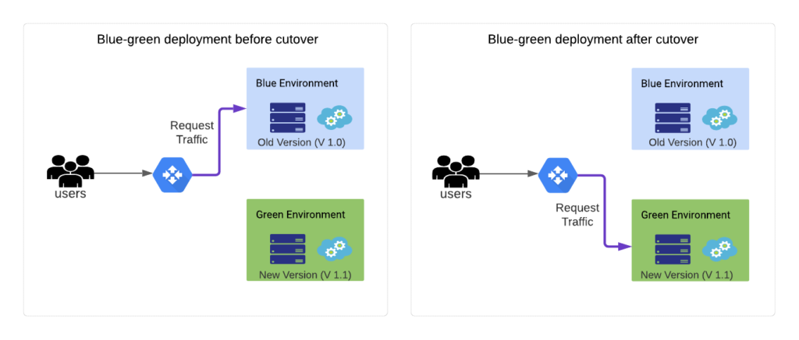
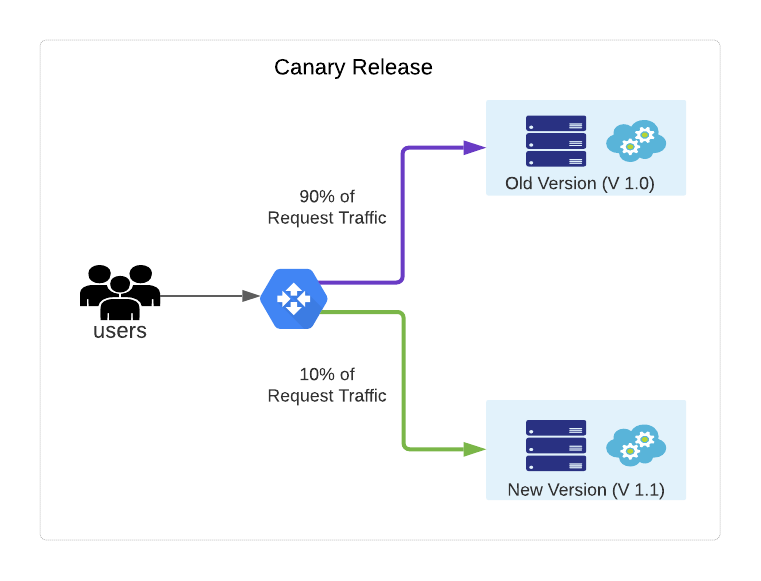
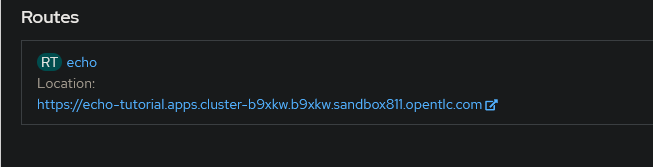
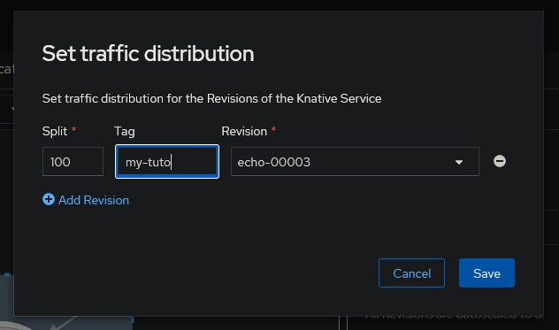
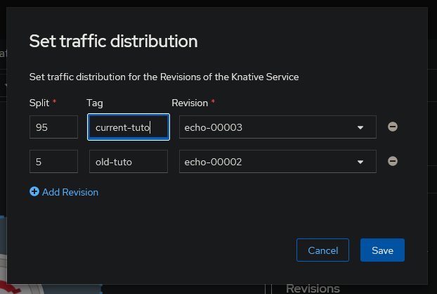
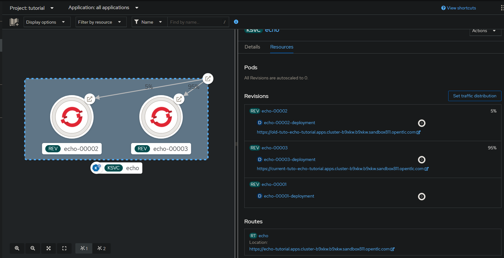
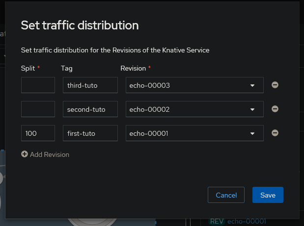
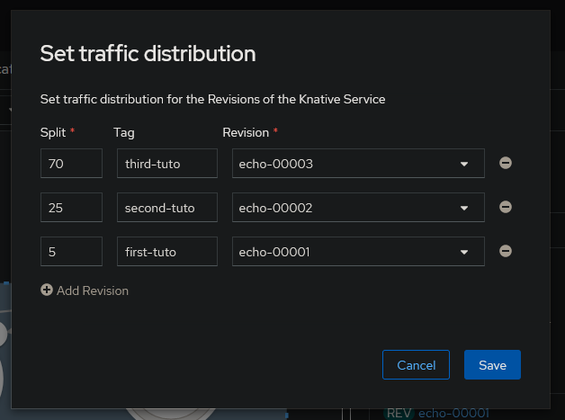

## **4. Gestionar Revisiones de Servicios y Control de Tráfico**

Cada aplicación Serverless de Red Hat OpenShift tiene un recurso de Servicio Knative, un recurso de Configuración Knative y uno o más objetos de Revisión Knative. OpenShift Serverless crea una nueva revisión para cada nueva configuración y para las actualizaciones de la configuración. 

Un cambio de configuración podría ser algo tan pequeño como cambiar el valor de una variable de entorno. El otro extremo es que el cambio de configuración podría usar una imagen completamente diferente. En ambos casos, el resultado es una nueva revisión.

Por ejemplo, el siguiente comando actualiza la aplicación de echo con un nuevo valor para la variable de entorno TARGET.
```bash
kn service update echo \
--env TARGET="Revision Green"
```

Por defecto, OpenShift Serverless asigna todas las solicitudes a la última revisión del servicio, sin embargo, todas las revisiones anteriores siguen estando disponibles. OpenShift Serverless proporciona controles que nos permiten especificar cuánto tráfico va a cada revisión. Este control de tráfico flexible permite muchos escenarios de implementación, como Blue/Green, Canary o incluso algo más personalizado que se adapte a nuestras necesidades.

### **4.1 Implementación Blue/Green**

El escenario de Implementación Blue/Green describe la actualización de una aplicación desde una versión, referida como la versión Blue, a una segunda versión, referida como la versión Green. Un beneficio significativo de la implementación Blue/Green es que el escenario mantiene una disponibilidad del 100% para el usuario final. No hay tiempo de inactividad para una implementación Blue/Green.

El escenario comienza con todos los usuarios que acceden a la versión Blue. Luego, comienza la implementación de una nueva versión, la versión Green, mientras Blue sigue funcionando. Cuando la versión Green está lista para estar disponible públicamente, el enrutador dirige todo el tráfico nuevo para acceder a la versión Green. El escenario detiene la versión Blue, después de que finalice todas las solicitudes actuales. La transición de Blue a Green es perfecta para los usuarios finales.



OpenShift Serverless realiza una implementación Blue/Green de forma predeterminada. OpenShift Serverless puede determinar cuándo una revisión está lista para recibir tráfico mediante las sondas de supervivencia. Al crear una nueva revisión, la revisión anterior recibe todo el tráfico hasta que la nueva revisión esté lista. Luego, el enrutador cambia automáticamente la ruta para dirigir todo el tráfico nuevo a utilizar la nueva revisión. La revisión anterior se cierra de forma ordenada.

El escenario de implementación Blue/Green funciona bien cuando hay una alta confianza en la nueva versión del software. Sin embargo, puede que no sea la mejor opción para un cambio de software importante.

### **4.2. Implementación Canary**

El escenario de Implementación Canary es un enfoque más cauteloso que a menudo es mejor para cambios importantes de software. Para un cambio importante de software, es una buena idea implementar la nueva versión en una pequeña muestra de usuarios. La pequeña muestra puede ayudar a determinar si la nueva versión proporciona todos los beneficios esperados. 

Si la nueva versión funciona según lo esperado, entonces se puede aumentar gradualmente el porcentaje de solicitudes que se dirigen a la nueva versión. De lo contrario, si la nueva versión resulta problemática, se puede deshacer redirigiendo a todos los usuarios a la versión anterior.



Los controles de enrutamiento de tráfico Serverless de OpenShift proporcionan la flexibilidad para dirigir las solicitudes a múltiples revisiones. Esta flexibilidad permite el uso de implementaciones de canarios o cualquier variación personalizada necesaria para apoyar el negocio.

### **4.3. Enrutamiento de tráfico**

Al crear o actualizar un servicio, OpenShift Serverless crea una nueva revisión para el servicio. Usaremos el comando kn revision list para ver una lista de revisiones disponibles. La salida de este comando tiene una columna llamada TRAFFIC que muestra el porcentaje de solicitudes enrutadas a esa revisión:
```bash
kn revision list
```

Asimismo, la consola web proporciona una vista gráfica de todas las revisiones. Para ver la lista de revisiones en la consola web, iniciaremos sesión en la plataforma de contenedores Red Hat OpenShift (RHOCP) y seleccionaremos la perspectiva Desarrollador. 

A continuación, nos iremos a la vista Topología y haremos clic en el objeto KSVC que corresponde a su aplicación. En la barra lateral que se abre, haremos clic en Recursos.

<div align="center">

</div>

**Enrutamiento en OpenShift Serverless**

Las rutas en OpenShift Serverless describen cómo asignar solicitudes HTTP entrantes a revisiones específicas en OpenShift Serverless. Usaremos kn route list para ver las rutas:
```bash
kn route list
```

Use kn route describe para ver los detalles de una ruta:
```bash
kn route describe echo
```

**Configuración de implementaciones Canary**

Supongamos que acaba de desarrollar una nueva versión de su software. La nueva versión tiene cambios significativos desde la versión anterior. Decidimos usar una implementación Canary para lanzar la nueva versión solo a una pequeña muestra de usuarios.

Recordemos que al crear una actualización, se dirige automáticamente el enrutador para enviar todo el tráfico a la última revisión. Para evitar esto, primero deberemos fijar la ruta para usar la revisión actualmente implementada.

Después de fijar la ruta, agregaremos una nueva versión no dirige ningún tráfico a la nueva revisión. El siguiente ejemplo muestra cómo fijar la ruta.

Iniciamos sesión en la consola web RHOCP y seleccionamos la perspectiva Desarrollador. A continuación, iremos a la vista Topología y haremos clic en el objeto KSVC que corresponde a su aplicación. En la barra lateral que se abre, hacemos clic en Recursos. Bajo la etiqueta Rutas, haremos clic en la ruta de su aplicación.



Desde la página de detalles de la ruta que se abre, haremos clic en YAML. La sección spec.traffic confirma que el 100 por ciento de todo el tráfico se envía a la última revisión. La sección de tráfico solo especifica la configuración y no una revisión específica.
```yaml	
apiVersion: serving.knative.dev/v1
kind: Route
...
spec:
  traffic:
    - configurationName: echo
      latestRevision: true
      percent: 100
status:
...
```

Regresaremos a la vista de Recursos y haremos clic en Establecer distribución de tráfico. En el campo de etiqueta, agregaremos un nombre descriptivo de la etiqueta y haremos clic en Guardar. 



Volveremos a la vista YAML de los Detalles de la ruta. Observaremos que la sección spec.traffic ahora muestra que la ruta está fijada a una revisión y no solo a la configuración.
```yaml
apiVersion: serving.knative.dev/v1
kind: Route
...
spec:
  traffic:
    - latestRevision: false
      percent: 100
      revisionName: echo-00003
      tag: my-tuto
....
```

Este cambio instruye a Knative a dirigir el 100 por ciento de todas las solicitudes a la revisión echo-00003. La ruta de servicio ignora cualquier otra revisión. Esto es exactamente lo que necesita para iniciar una Implementación Canary.

Regresemos a la vista de Recursos nuevamente y hagamos clic en Establecer distribución de tráfico. Haremos clic en Agregar revisión y seleccionaremos nuestra nueva revisión en el menú desplegable para la segunda fila de la lista. En la columna de División, configuraremos la división de tráfico entre las dos revisiones y guardaremos el cambio.

<div align="center">

</div>

La gráfica de nuestra aplicación muestra la división entre las dos revisiones.

<div align="center">

</div>

La división de tráfico también se puede hacer desde la línea de comandos. El siguiente comando ilustra cómo usar la opción --traffic para lograr este estado deseado:
```bash
 kn service update echo \
--traffic echo-00001=95 \
--traffic echo-00003=5
```

En cada opción --traffic de este comando, se especifica el nombre de la revisión, un signo igual, y luego el porcentaje de tráfico dirigido a la revisión. Después de ejecutar este comando, la revisión anterior recibe el 95 por ciento de todo el tráfico, mientras que la nueva revisión recibe el 5 por ciento. El comando puede usar tantas opciones --traffic como necesitemos, pero los valores deben sumar 100.

Usaremos el comando kn route describe para confirmar los resultados del cambio:
```bash
kn route describe echo
```

La sección Traffic Targets de la salida confirma que la nueva revisión recibe solo el 5 por ciento de todas las solicitudes mientras que la revisión anterior sigue manejando el resto. Cuando estemos satisfechos de que la última revisión es estable, usaremos la consola web RHOCP o la línea de comandos para dirigir todo el tráfico a la última revisión. 

Usaremos el siguiente comando para enrutar todo el tráfico a la última revisión desde la línea de comandos:
```bash
kn service update echo --traffic @latest=100
```

La opción --traffic permite muchos patrones de implementación, incluyendo despliegues Blue/Green, Canary y progresivos.

**Etiquetas de ruta**

La etiqueta @latest utilizada en el ejemplo anterior es un caso especial de una etiqueta de enrutamiento. Una etiqueta es un nombre que apunta a una revisión. La etiqueta @latest está siempre disponible y siempre apunta a la última revisión. Esta etiqueta es un caso especial porque cambia cada vez que se crea una nueva revisión. Otras etiquetas son estáticas, apuntando solo a una revisión asignada.

El siguiente ejemplo ilustra cómo crear una nueva etiqueta.
```bash
kn service update echo \
--tag echo-00003=my-new-tag
```

Este comando crea una nueva etiqueta con el nombre my-new-tag, que apunta a la revisión echo-00003. La etiqueta es parte del recurso Route en lugar del recurso Configuration. Por lo tanto, crear una nueva etiqueta no genera una nueva revisión.

La adición de la etiqueta tiene el beneficio de crear también una URL especial que se dirige a la revisión etiquetada. Para el ejemplo anterior, el usuario puede enviar una solicitud a esa revisión específica.

La URL principal, donde fluye el tráfico según las reglas de tráfico, incluye solo el nombre del servicio y el nombre del host.
```bash
https://echo-tutorial.apps.cluster-b9xkw.b9xkw.sandbox811.opentlc.com
```

Agregar etiquetas a una revisión amplía la flexibilidad de implementación. Puede enviar una solicitud directamente a una revisión etiquetada, omitiendo las reglas de tráfico, con una URL que también incluye el nombre de la etiqueta.
```bash
https://my-new-tag-echo-tutorial.apps.cluster-b9xkw.b9xkw.sandbox811.opentlc.com/
```

**Implementación personalizada**

Para implementar un escenario de implementación personalizado, primero fijaremos la ruta como se discutió anteriormente. Luego agregaremos tantas revisiones como sea necesario. Actualizaremos la ruta usando la opción --tag para asignar una etiqueta a cada revisión. 

En este punto, podemos probar cualquier revisión usando las URL específicas de la etiqueta, mientras que todo el tráfico normal del usuario sigue llegando a la revisión fijada. Actualmente lo tengo configurado de la siguiente manera:



Actualizaremos la ruta para enviar un porcentaje de tráfico a las revisiones especificadas usando la opción --traffic. Podemos usar nombres de etiquetas en lugar de nombres de revisión para mayor comodidad.
```bash
kn service update echo \
--traffic first-tuto=5 \
--traffic second-tuto=25 \
--traffic third-tuto=70
```

Comprobamos que la ruta se ha actualizado correctamente:



Nuevamente, todas las asignaciones de tráfico deben sumar 100. El nombre de etiqueta @latest siempre está disponible y apunta a la última revisión. La asignación puede utilizar todas las revisiones disponibles o solo un subconjunto. La adición de etiquetas permite cualquier escenario de implementación personalizado.
