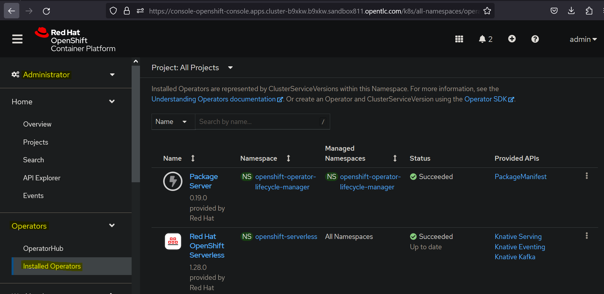
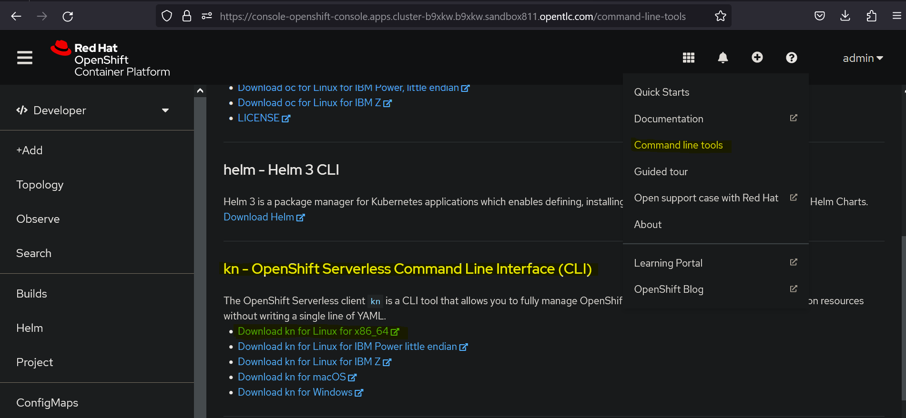
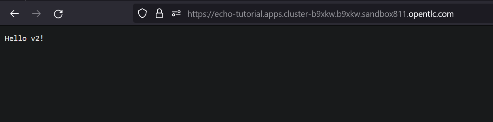

## **3. Knative Serving**

Knative Serving es el componente responsable de:

• Desplegar aplicaciones

• Actualizar aplicaciones

• Enrutar el tráfico a aplicaciones

• Escalar automáticamente las aplicaciones

Knative Serving crea nuevos despliegues en nuevas versiones de cada aplicación. Implementa nuevas versiones para asegurarse de que el tráfico solo se redirige a versiones funcionales de la aplicación. Los pods creados por estos nuevos despliegues reciben tráfico a medida que están disponibles.

Knative Serving admite despliegues Blue/Green, despliegues Canary y despliegues progresivos.

Cuando no hay tráfico, Knative Serving escala los pods de la aplicación hasta cero y redirige el tráfico a un componente llamado Activator. 
El Activator envía una petición al componente Autoscaler para escalar los pods de la aplicación cuando hay nuevo tráfico. Mientras el pod de la aplicación se prepara, el Activator proxy almacena en búfer todas las solicitudes de la aplicación. 
Después de que finaliza el proceso de activación, el Autoscaler redirige el tráfico futuro al nuevo pod, y el Activator no se usa hasta que se escala de nuevo a cero.

Knative Serving utiliza varios servicios agrupados en las siguientes categorías:

**Reconcilers:** Los servicios en esta categoría determinan las diferencias entre el estado esperado de cualquier aplicación y el estado real en el clúster, y luego trabajan para hacer la transición de la aplicación al estado deseado.

**Webhooks:** Los servicios de webhooks capturan solicitudes a la API de Kubernetes, validan configuraciones de recursos e inyectan información de enrutamiento y red a los servicios.

**Networking controllers:** Estos controladores son responsables de crear y renovar certificados TLS, y de crear controladores de ingreso para redirigir el tráfico a los servicios apropiados.

**Autoscaler:** consiste en un conjunto de servicios que escalan hacia arriba y hacia abajo las aplicaciones de los usuarios en función del tráfico entrante. En resumen, establece el número de réplicas de pod, según el tráfico.

### **3.1. Instalación de Knative Serving**

Antes de comenzar a usar Knative Serving, deberemos verificar que esté instalado en nuestro clúster RHOCP.

**Mediante la consola web:**

**Prerrequisitos**

- Deberemos tener acceso a una cuenta en OpenShift Container Platform con acceso de administrador de clúster.

- Deberemos haber iniciado sesión en la consola web de la plataforma de contenedores OpenShift.

- Deberemos haber instalado el operador Serverless de OpenShift.

**Instalación**

1. En la perspectiva del administrador de la consola web de la plataforma de contenedores OpenShift, nos vamos a Operadores → Operadores instalados.



2. Comprobamos que el menú desplegable de Proyecto en la parte superior de la página esté configurado en Proyecto: knative-serving.

3. Hacemos clic en Knative Serving en la lista de API proporcionadas para el operador Serverless de OpenShift para ir a la pestaña Knative Serving.

4. Hacemos clic en Crear Knative Serving.

5. En la página Crear Knative Serving, podemos instalar Knative Serving utilizando la configuración predeterminada haciendo clic en Crear.

6. Después de instalar Knative Serving, se crea el objeto KnativeServing y nos dirige automáticamente a la pestaña Knative Serving. Veremos el recurso personalizado knative-serving en la lista de recursos.

**Desde la CLI:**

**Prerrequisitos**

- Tener acceso a una cuenta de OpenShift Container Platform con acceso de administrador de clúster.

- Haber instalado el Operador Serverless de OpenShift.

- Tener instalado la CLI de OpenShift (oc).

**Instalación**

1. Crearemos un archivo llamado serving.yaml y copiaremos el siguiente YAML de ejemplo en él:
```yaml
apiVersion: operator.knative.dev/v1beta1
kind: KnativeServing
metadata:
    name: knative-serving
    namespace: knative-serving
```

2. Aplicaremos el archivo serving.yaml:
```bash	
oc apply -f serving.yaml
```

### **3.2. Instalación de Knative CLI**

Knative CLI es una herramienta de línea de comandos que nos permite interactuar con los recursos de Knative. Podemos usar Knative CLI para crear y administrar recursos de Knative, como servicios, rutas, revisiones y configuraciones.

**Prerrequisitos**

- Tener acceso a una cuenta de OpenShift Container Platform con acceso de administrador de clúster.

- Tener instalado la CLI de OpenShift (oc).

- Haber instalado el Operador Serverless de OpenShift y Knative Serving.

**Instalación**

1. Nos dirigiremos a la consola web de Openshift y elegiremos la opción Command line tools en el icono de ayuda (?):



2. Nos descargaremos la herramienta que se adapte a nuestro sistema operativo.

3. Una vez descargada, la descomprimiremos y la añadiremos al PATH de nuestro sistema operativo. En mi caso:
```bash
tar -xf kn-linux-amd64.tar.gz
sudo cp kn /usr/local/bin
```

### **3.3. Desplegando aplicaciones Serverless**

Podemos desplegar una aplicación Serverless creando un objeto de servicio Knative. El siguiente ejemplo muestra cómo podemos definir un servicio Knative simple usando un archivo YAML.
```yaml
apiVersion: serving.knative.dev/v1 # La API de Knative Serving.
kind: Service  # El CRD de Knative Service.
metadata:
  name: echo  # El nombre de tu aplicación Serverless.
spec:
  template:
    spec:
      containers:
      - image: quay.io/redhattraining/kbe-knative-echo:v1 # La imagen de contenedor para desplegar.
        ports:
        - containerPort: 8080  # El puerto de la aplicación.
        env:           # Variables de entorno inyectadas en la aplicación.
        - name: MY_VAR
          value: "12345"
```

Para desplegar esta aplicación, podemos crear el servicio Knative usando la consola web de RHOCP o mediante línea de comandos oc. Además, también podemos crear un servicio Knative mediante línea de comandos Knative (kn).

**Creando un servicio Knative desde un archivo YAML**

De manera similar a la creación de otros objetos de Kubernetes, se puede utilizar el comando "oc apply" para crear un servicio Knative a partir de un archivo YAML. Primero, es necesario crear el archivo YAML que define el servicio Knative. 

Ejecutaríamos el siguiente comando para implementar la aplicación:
```bash	
oc apply -f service-deployment-example.yaml
```

Para verificar que el servicio Knative se ha creado correctamente, podemos ejecutar el siguiente comando:
```bash
oc get ksvc
```

Para borrar el servicio Knative, podemos ejecutar el siguiente comando:
```bash
oc delete ksvc service-deployment-example.yaml
```

**Creando un servicio Knative utilizando la consola web**

Desde la perspectiva del desarrollador, haremos clic en +Add. Si deseamos implementar una aplicación desde una imagen de contenedor, entonces hacemos clic en Imágenes de contenedor. Si deseamos implementar una aplicación desde un repositorio Git, entonces hacemos clic en Importar desde Git.


En este caso vamos a ver como se haría desde una imagen de contenedor. Debemos completar los campos requeridos en el formulario.


A continuación, en el panel de Recursos, seleccionamos la opción de Implementación Serverless. Al seleccionar esta opción, se implementa la aplicación como un servicio Knative.


Para terminar, hacemos clic en Create y ya tendremos nuestra aplicación desplegada.


**Creando un Servicio Knative utilizando la CLI kn**

También podemos implementar aplicaciones Serverless con la CLI kn. Para crear un nuevo servicio Knative, usaremos el comando kn service create especificando la imagen de contenedor que deseamos implementar. Opcionalmente, también podemos pasar otros parámetros de configuración, como se muestra el siguiente ejemplo:
```bash
kn service create echo \
--image=quay.io/redhattraining/kbe-knative-echo:v1 --port=8080
```

El comando anterior crea un nuevo servicio Knative llamado "echo", que implementa la imagen "quay.io/redhattraining/kbe-knative-echo:v1". El servicio Knative recién creado implementa la imagen especificada en un pod que escucha en el puerto 8080.

Para verificar que el servicio Knative se ha creado correctamente, podemos ejecutar el siguiente comando:
```bash
kn service list
```

Para borrar el servicio Knative, podemos ejecutar el siguiente comando:
```bash
kn service delete echo
```

**Creando Servicios Privados**

En algunos casos, es posible que deseemos crear servicios Knative privados que no estén expuestos al público. Para crear un servicio privado, utilizamos la opción --cluster-local, como se muestra en el siguiente ejemplo:
```bash
 kn service create echo \
--image=quay.io/redhattraining/kbe-knative-echo:v1 --port=8080 \
--cluster-local
```

Al usar la opción --cluster-local, se agrega la etiqueta networking.knative.dev/visibility=cluster-local al servicio recién creado. Cuando un servicio Knative incluye esta etiqueta, Knative crea una URL de ruta local para el servicio.

### **3.4. Inspeccionando una aplicación Serverless**

Usando la consola web RHOCP, podemos verificar los objetos que Knative ha creado después de desplegar la aplicación.
En la consola web RHOCP, cambiamos a la perspectiva de desarrollador y navegamos a la vista Topología. El gráfico de la topología muestra los servicios Knative como elementos KSVC y las revisiones como elementos REV. Si hacemos clic en alguno de estos elementos, se abrirá una barra lateral revelando información adicional.

Por ejemplo, si hacemos clic en el elemento KSVC, que representa un servicio Knative, la barra lateral mostrará una lista de los pods, revisiones y rutas Knative asociadas con el servicio.

<div align="center">

</div>

**Inspeccionando una aplicación Serverless con herramientas de línea de comandos**

También podemos inspeccionar los recursos de Knative utilizando la interfaz de línea de comandos kn. Además del comando ya visto anteriormente **kn service list** podremos usar otros. Por ejemplo, para listar las revisiones de un servicio determinado, utilizamos el comando kn revision list de la siguiente manera:
```bash
kn revisions list --service echo
```

La opción --service filtrará las revisiones por el nombre del servicio Knative.

El CLI kn acepta varios comandos para obtener detalles adicionales sobre los recursos de Knative, como kn service y kn route, entre otros. Por ejemplo, usaremos el comando kn routes list para listar nuestras rutas de Knative y obtener las URLs públicas de nuestros servicios de Knative.
```bash
kn routes list
```

De igual manera, utilizaremos el comando kn routes describe para obtener detalles específicos acerca de una ruta en particular.

Además del panel web y la interfaz de línea de comandos kn, también podríamos utilizar comandos oc regulares, como list y describe, para inspeccionar los recursos personalizados de Knative. Por ejemplo, describiremos un servicio Knative en particular de la siguiente manera:
```bash
oc describe service.serving.knative.dev echo
```

Para ver los detalles de una revisión en particular, usaremos el comando oc describe de la siguiente manera:
```bash	
oc describe revision.serving.knative.dev echo-00001
```

Del mismo modo, aplicaremos estos comandos para describir o listar otros recursos personalizados, como rutas de Knative.

### **3.5. Actualizando una aplicación Serverless**

El método preferido, según la fuente oficial, para actualizar un servicio Knative es utilizar el comando "kn service update" de la siguiente manera:
```bash
kn service update echo \
--image=quay.io/redhattraining/kbe-knative-echo:v2
```

Si nos vamos a la web, podremos ver que ahora dice Hello v2 en lugar de Hello v1.



Tenemos que tener en cuenta que, al actualizar un servicio Knative con "kn", no es necesario especificar la lista completa de parámetros de configuración. Solo pasaremos los parámetros de configuración que necesita actualizar. 

Por ejemplo, si deseamos actualizar un servicio Knative privado para que sea público, usaremos la opción "--no-cluster-local".
```bash
kn service update echo --no-cluster-local
```
En caso de querer actualizar un servicio Knative para que sea privado, usaremos la opción "--cluster-local".
```bash
kn service update echo --cluster-local
```

Alternativamente, podríamos actualizar un servicio Knative editando el YAML del servicio Knative en la consola web RHOCP o utilizando los comandos "oc patch" o "oc apply".
